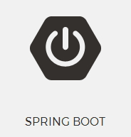

# Spring Boot Tutorial 《Spring Boot 教程》

Spring Boot  Tutorial takes you to learn Spring Boot  step by step with a large number of samples. There is also a GitBook version of the book: <http://www.gitbook.com/book/waylau/spring-boot-tutorial>.
Let's [READ](SUMMARY.md)!

Spring Boot Tutorial 是一本关于 Spring Boot 学习的开源书。利用业余时间写了本书，图文并茂，用大量实例带你一步一步走进 Spring Boot 的世界。如有疏漏欢迎指正，欢迎提问。感谢您的参与！
 
### Get Started 如何开始阅读

选择下面入口之一：

* <https://github.com/waylau/spring-boot-tutorial/> 的 [SUMMARY.md](SUMMARY.md)（源码）
* <http://waylau.gitbooks.io/spring-boot-tutorial/> 点击 Read 按钮（同步更新，国内访问速度一般）
 
### Watch Videos 教学视频

本课程另有视频版本，可供学习<http://coding.imooc.com/class/125.html>

### Code 源码

书中所有示例源码，移步至<https://github.com/waylau/spring-boot-tutorial>  `samples` 目录下

### Issue 意见、建议

如有勘误、意见或建议欢迎拍砖 <https://github.com/waylau/spring-boot-tutorial/issues>

### Contact 联系作者:

* Blog: [waylau.com](http://waylau.com)
* Gmail: [waylau521(at)gmail.com](mailto:waylau521@gmail.com)
* Weibo: [waylau521](http://weibo.com/waylau521)
* Twitter: [waylau521](https://twitter.com/waylau521)
* Github : [waylau](https://github.com/waylau)
