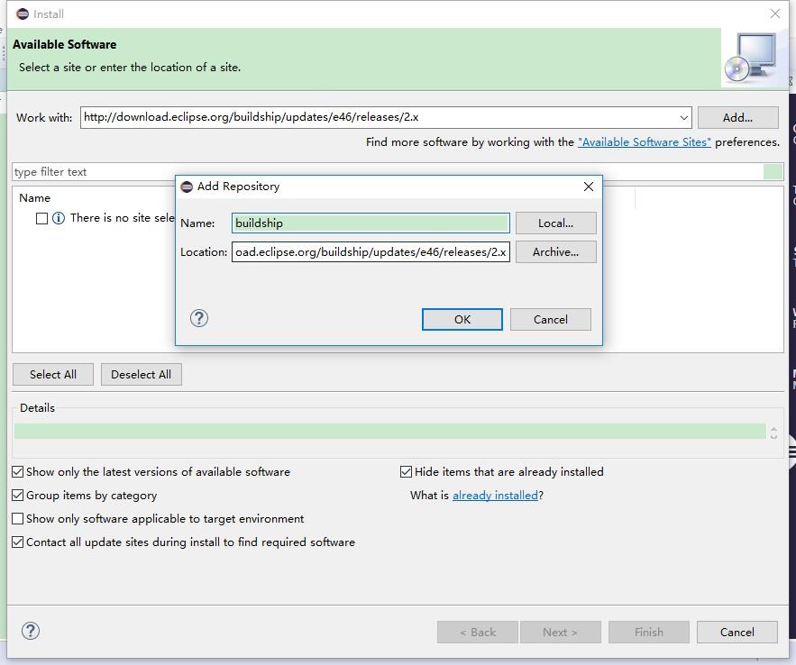
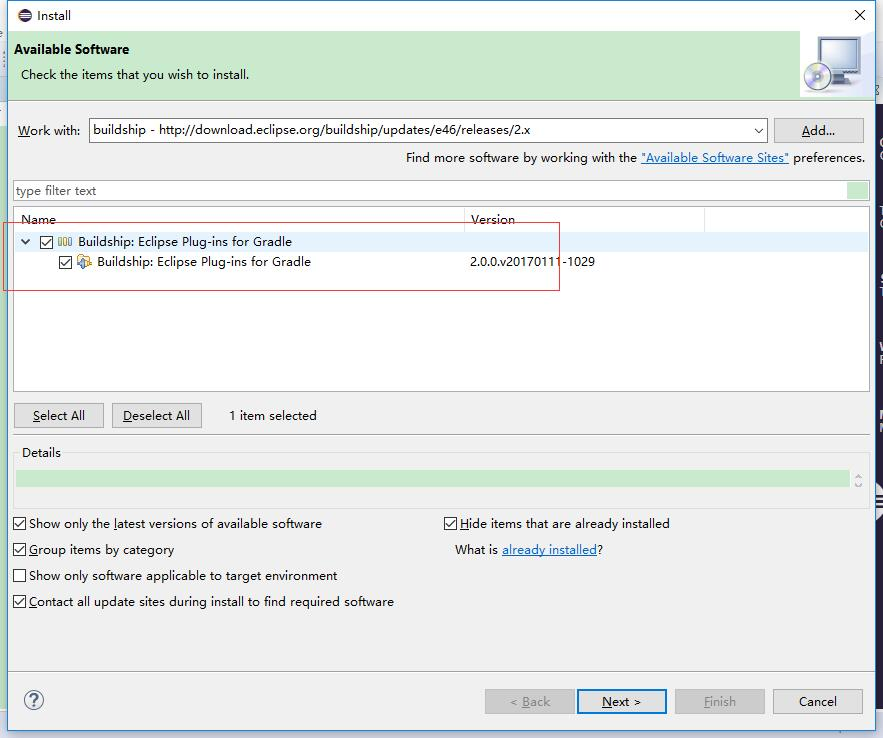
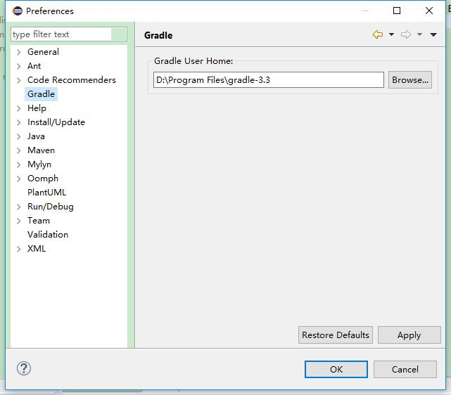
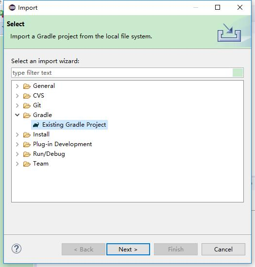
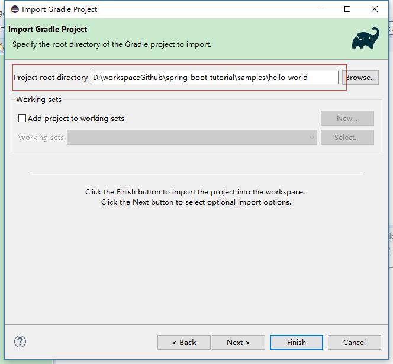
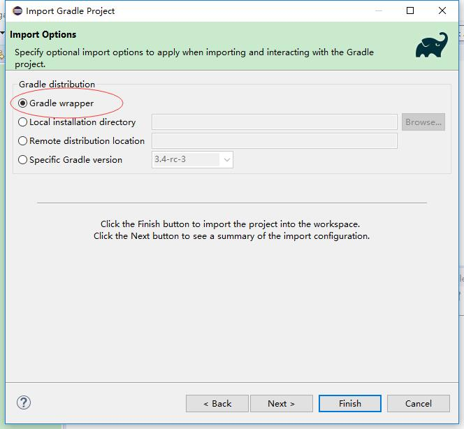

# 将项目导入IDE

本节内容讲述了如何将Spring Boot项目，导入IDE中进行开发。本例子所选用的IDE为 Eclipse。

## 所需环境

本例子采用的开发环境如下：

* JDK 8
* Gradle 3.3
* Eclipse 4.6

## 配置 Eclipse


各个版本的Eclipse 所默认安装的插件不同，比如 Eclipse for Java 里面就集成了常用的插件。所以，如果你没有相关的插件，请自行安装。本节只介绍插件的基本配置及使用。


###  1. 安装的 Gradle 插件（可选）

在 Eclipse 中，点击“Help -> Install New Software...”

添加  Gradle 插件 Buildship 的地址：





选中插件，进行安装即可。



###  2. 配置用户安装的 Gradle（可选）


在“Windows -> Preferences” 对 Gradle 进行设置，指定一个 Gradle 的用户安装目录。




注：如果你是采用 Gradle Wrapper 形式来导入项目的话，本步骤也是可选的。


## 导入项目到 Eclipse

本节演示导入之前我们的`hello-world`项目。

在导入类型时，我们选择“Existing Gradle Project”:



指定要导入的项目的路径:




选择Gradle 的分发布的类型。支持多种分发形式，本例子采用 Gradle Wrapper 形式 :



## 运行程序

有多种运行 Spring Boot 程序的方式：

### 1. 使用 `java -jar` 命令

正如我们在前面章节所讲的，如果项目是打包成一个可运行的 jar 文件，则可以使用 `java -jar` 方式运行程序。

### 2. 以“Java Application”运行

`hello-world`程序就是一个平常的 Java 程序，所以直接右键项目，在开发时，可以以“Java Application”运行程序。


### 3. 使用 Spring Boot Gradle Plugin 插件运行

Spring Boot 已经内嵌了Spring Boot Gradle Plugin 插件，所以可以使用 Spring Boot Gradle Plugin 插件来运行程序。在命令行执行方式如下：

```
gradle bootRun
```

或者 


```
gradlew bootRun
```