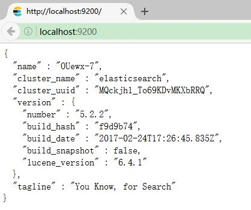

# Elasticsearch 安装和使用

## 环境

* Windows 10
* Java 8 +
* Elasticsearch 5.2.2


## 下载安装 Elasticsearch

下载地址：<https://www.elastic.co/downloads/elasticsearch> 解压之后，有一个名为`elasticsearch-5.2.2`的文件夹，我们将其称为`％ES_HOME％` 变量。 在终端窗口中，切换到`％ES_HOME％`目录，例如：

```
cd c:\elasticsearch-5.2.2
```

## 运行

命令行执行：

```
.\bin\elasticsearch
```

正常启动后，如下：


```
c:\elasticsearch-5.2.2>.\bin\elasticsearch
[2017-03-12T17:39:32,784][INFO ][o.e.n.Node               ] [] initializing ...
[2017-03-12T17:39:33,822][INFO ][o.e.e.NodeEnvironment    ] [OUewx-7] using [1] data paths, mounts [[(c:)]], net usable_space [56.7gb], net total_space [99.5gb], spins? [unknown], types [NTFS]
[2017-03-12T17:39:33,823][INFO ][o.e.e.NodeEnvironment    ] [OUewx-7] heap size [1.9gb], compressed ordinary object pointers [true]
[2017-03-12T17:39:33,832][INFO ][o.e.n.Node               ] node name [OUewx-7] derived from node ID [OUewx-7ZTdWtxrILgvqGOw]; set [node.name] to override
[2017-03-12T17:39:33,868][INFO ][o.e.n.Node               ] version[5.2.2], pid[10832], build[f9d9b74/2017-02-24T17:26:45.835Z], OS[Windows 10/10.0/amd64], JVM[Oracle Corporation/Java HotSpot(TM) 64-Bit Server VM/1.8.0_112/25.112-b15]
[2017-03-12T17:39:38,400][INFO ][o.e.p.PluginsService     ] [OUewx-7] loaded module [aggs-matrix-stats]
[2017-03-12T17:39:38,401][INFO ][o.e.p.PluginsService     ] [OUewx-7] loaded module [ingest-common]
[2017-03-12T17:39:38,401][INFO ][o.e.p.PluginsService     ] [OUewx-7] loaded module [lang-expression]
[2017-03-12T17:39:38,402][INFO ][o.e.p.PluginsService     ] [OUewx-7] loaded module [lang-groovy]
[2017-03-12T17:39:38,402][INFO ][o.e.p.PluginsService     ] [OUewx-7] loaded module [lang-mustache]
[2017-03-12T17:39:38,402][INFO ][o.e.p.PluginsService     ] [OUewx-7] loaded module [lang-painless]
[2017-03-12T17:39:38,403][INFO ][o.e.p.PluginsService     ] [OUewx-7] loaded module [percolator]
[2017-03-12T17:39:38,403][INFO ][o.e.p.PluginsService     ] [OUewx-7] loaded module [reindex]
[2017-03-12T17:39:38,404][INFO ][o.e.p.PluginsService     ] [OUewx-7] loaded module [transport-netty3]
[2017-03-12T17:39:38,405][INFO ][o.e.p.PluginsService     ] [OUewx-7] loaded module [transport-netty4]
[2017-03-12T17:39:38,406][INFO ][o.e.p.PluginsService     ] [OUewx-7] no plugins loaded
[2017-03-12T17:39:47,538][INFO ][o.e.n.Node               ] initialized
[2017-03-12T17:39:47,538][INFO ][o.e.n.Node               ] [OUewx-7] starting ...
[2017-03-12T17:39:49,888][INFO ][o.e.t.TransportService   ] [OUewx-7] publish_address {127.0.0.1:9300}, bound_addresses {127.0.0.1:9300}, {[::1]:9300}
[2017-03-12T17:39:53,091][INFO ][o.e.c.s.ClusterService   ] [OUewx-7] new_master {OUewx-7}{OUewx-7ZTdWtxrILgvqGOw}{X7GHHnmUSX2cmKb-WYf5vg}{127.0.0.1}{127.0.0.1:9300}, reason: zen-disco-elected-as-master ([0] nodes joined)
[2017-03-12T17:39:53,201][INFO ][o.e.g.GatewayService     ] [OUewx-7] recovered [0] indices into cluster_state
[2017-03-12T17:39:54,213][INFO ][o.e.h.HttpServer         ] [OUewx-7] publish_address {127.0.0.1:9200}, bound_addresses {127.0.0.1:9200}, {[::1]:9200}
[2017-03-12T17:39:54,214][INFO ][o.e.n.Node               ] [OUewx-7] started
```
执行`Ctrl-C` 用来停止。


## 配置

默认情况下，Elasticsearch从`%ES_HOME%/config/elasticsearch.ym`文件加载其配置。 此配置文件的格式在[配置 Elasticsearch](https://www.elastic.co/guide/en/elasticsearch/reference/current/settings.html) 中进行了说明。

还可以在命令行上使用`-E`语法指定可以在配置文件中指定的任何设置，如下所示：

```
./bin/elasticsearch -Ecluster.name=my_cluster -Enode.name=node_1
```

>注意:包含空格的值必须加上双引号， 例如`-Epath.logs="C:\My Logs\logs"`。

>提示：通常，任何集群范围的设置（如`cluster.name`）都应该添加到 elasticsearch.yml 配置文件中，而任何特定于节点的设置（如`node.name`）都可以在命令行中指定。

## 确认运行情况


您可以通过向 localhost 上的端口 9200 发送 HTTP 请求来测试 Elasticsearch 节点是否正在运行：

```
GET /
```

控制台应能做出如下的响应：

```
{
  "name" : "OUewx-7",
  "cluster_name" : "elasticsearch",
  "cluster_uuid" : "MQckjh1_To69KDvMKXbRRQ",
  "version" : {
    "number" : "5.2.2",
    "build_hash" : "f9d9b74",
    "build_date" : "2017-02-24T17:26:45.835Z",
    "build_snapshot" : false,
    "lucene_version" : "6.4.1"
  },
  "tagline" : "You Know, for Search"
}
```


下面是从浏览器来访问 Elasticsearch 的效果：





## 作为 Windows 服务


执行 `bin` 目录下 `elasticsearch-service.bat` 即可，允许用户从命令行来安装、删除、管理或配置服务，并能启动和停止服务。。

```
c:\elasticsearch-5.2.2\bin>elasticsearch-service

Usage: elasticsearch-service.bat install|remove|start|stop|manager [SERVICE_ID]
```

安装后，应能看到如下信息：

```
c:\elasticsearch-5.2.2\bin>elasticsearch-service install
Installing service      :  "elasticsearch-service-x64"
Using JAVA_HOME (64-bit):  "c:\jvm\jdk1.8"
The service 'elasticsearch-service-x64' has been installed.


```