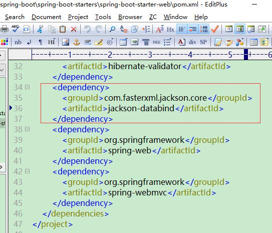
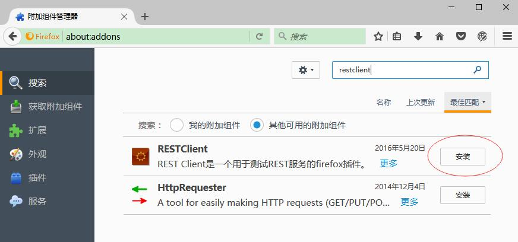
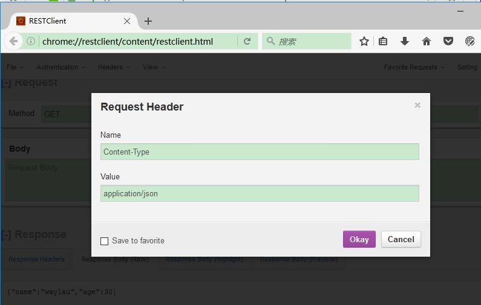
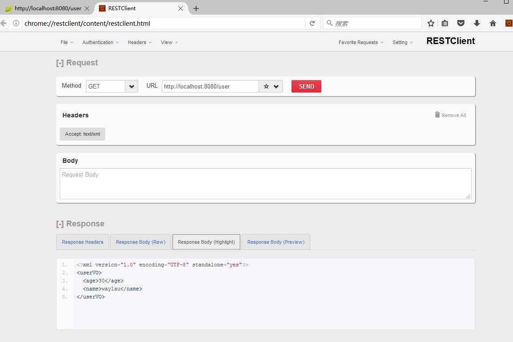

# 处理 Spring MVC 常用 MediaType（媒体类型）

在 `hello-world`项目基础上，我们创建了一个 `media-type`项目。项目的包名也做了调整，改为`com.waylau.spring.boot.mediatype`。

## build.gradle

修改 build.gradle 文件，让我们的`media-type`项目成为一个新的项目。

修改内容也比较简单，修改项目名称及版本即可。

```
jar {
	baseName = 'media-type'
	version = '1.0.0'
}
```

## 处理器及VO


 
### 1. 创建 UserVO

创建`com.waylau.spring.boot.mediatype.vo.UserVO`的类，用于返回用户信息。UserVO 是一个 POJO。

UserVO.java 代码如下：

```java
public class UserVO {

	private String name;
	private int age;

	public UserVO() {
	}

	public UserVO(String name, int age) {
		this.name = name;
		this.age = age;
	}

	public String getName() {
		return name;
	}

	public void setName(String name) {
		this.name = name;
	}

	public int getAge() {
		return age;
	}

	public void setAge(int age) {
		this.age = age;
	}

}

```


### 2. 创建 MediaTypeController
在 `com.waylau.spring.boot.mediatype.HelloController`类的基础上，我们创建了一个 `com.waylau.spring.boot.mediatype.MediaTypeController`类来作为本例的处理不同  MediaType 的处理器。

MediaTypeController.java 代码如下：

```java
package com.waylau.spring.boot.mediatype.controller;

import org.springframework.web.bind.annotation.RequestMapping;
import org.springframework.web.bind.annotation.RestController;

import com.waylau.spring.boot.mediatype.vo.UserVO;

/**
 * Media Type 控制器.
 * 
 * @author <a href="https://waylau.com">Way Lau</a>
 * @date 2017年2月24日
 */
@RestController
public class MediaTypeController {

	/**
	 * 根据客户端请求的 Content-Type，响应相应的 UserVO 类型.
	 * 
	 * @return
	 */
	@RequestMapping("/user")
	public UserVO getUser() {
		return new UserVO("waylau", 30);
	}

}

## 返回 JSON 类型 

在 Web 应用中，JSON 类型是比较常见的作为 API 的一种数据格式。

### 1. 运行项目

运行项目后，我们在浏览器里面访问：<http://localhost:8080/user> 接口。

### 2. 查看返回数据

发现，页面上，已经显示了 JSON 文本。也就是说，我们的请求就是返回的是  JSON 类型数据。


*为什么我们没有做任何特殊设置，数据可以被自动转成 JSON 格式？*

还记得我们项目的依赖`spring-boot-starter-web`吗？如果你打开这个`spring-boot-starter-web`项目的pom.xml的话，你会发现，该项目是依赖了 Jackson2 库：



Jackson2 库是非常流行的处理 JSON 的类库。Spring Boot 应用程序中的任何使用了`@RestController`注解的类，都会默认呈现JSON响应，只要将 Jackson2 放在 classpath 上。 

详见：<http://docs.spring.io/spring-boot/docs/1.5.1.RELEASE/reference/htmlsingle/#howto-write-a-json-rest-service>

## 返回 XML 类型

XML 是 Web Service 架构风格中的标准协议，应用广泛。本例演示，如果将一个 Java 对象映射成 XML 返回给客户端。
 
### 1. 添加JAXB

修改 UserVO，添加JAXB（Java Architecture for XML Binding)技术 。JAXB 是一个业界的标准，是一项可以根据 XML Schema 产生 Java 类的技术。该过程中，JAXB 也提供了将 XML 实例文档反向生成 Java 对象树的方法，并能将 Java 对象树的内容重新写到 XML 实例文档。从另一方面来讲，JAXB 提供了快速而简便的方法将 XML 模式绑定到 Java 表示，从而使得 Java 开发者在 Java 应用程序中能方便地结合 XML 数据和处理函数。 

JAXB 常用的注解包括：`@XmlRootElement`、`@XmlElement`等等。我们在UserVO类上添加`@XmlRootElement`注解，以便将 UserVO 映射为 XML。


UserVO.java 代码如下：

```java
import javax.xml.bind.annotation.XmlRootElement;

/**
 * User value object. 
 * @author <a href="https://waylau.com">Way Lau</a>
 * @date 2017年2月24日
 */
@XmlRootElement // Java对象 转为XML
public class UserVO {

	private String name;
	private int age;

	public UserVO() {
	}

	public UserVO(String name, int age) {
		this.name = name;
		this.age = age;
	}

	public String getName() {
		return name;
	}

	public void setName(String name) {
		this.name = name;
	}

	public int getAge() {
		return age;
	}

	public void setAge(int age) {
		this.age = age;
	}

}

```


### 2. Firefox 安装 RESTClient 插件

为了方便测试 REST API，我们需要一款软件来协助我们。由于我这里用 Firefox 浏览器居多，所以推荐安装  RESTClient 插件。当然，你可以根据个人喜好来安装其他软件。




### 3. 用 RESTClient 来测试。


在我们运行程序后，我们可以对<http://localhost:8080/user> 接口进行测试。

我们在 RESTClient 中的 Request Header 中设置 “Content-Type”为 “application/xml”，这样就能告诉后台接口，我想要的是 XML 数据。




设置请求的方法类型，及 API 地址，点击“SEND”按钮，能够方便看到返回的数据，及类型




RESTClient 也可以测试其他数据类型，比如，如果想要获得 JSON 数据，则将 “Content-Type”设置为 “application/json”
即可。