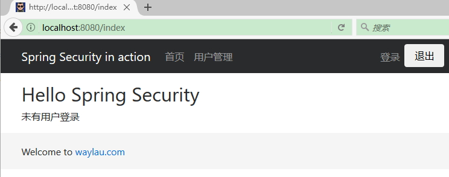
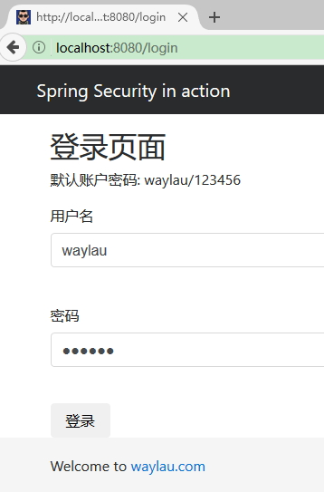
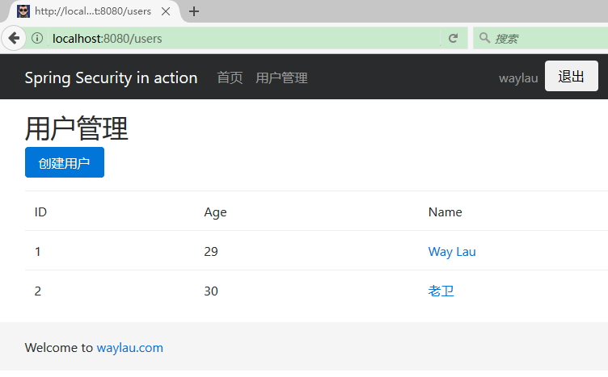
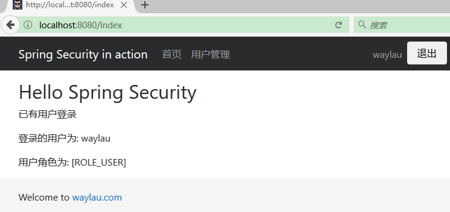

# Spring Security 实战

通过该项目，我们用 Spring Security 来实现对系统的安全管理。

我们在上一节创建的 `security-in-action`项目的基础上，做一些修改。


## 后台代码


### 安全配置类

增加 `com.waylau.spring.boot.security.config` 包，用于放置项目的配置类。在该包下，我们创建  SecurityConfig.java :


请求匹配/ css / **和/ index是完全可访问的
与/ user / **匹配的请求需要用户进行身份验证，并且必须与USER角色相关联
基于表单的身份验证使用自定义登录页面和失败URL启用

```java
@EnableWebSecurity
public class SecurityConfig extends WebSecurityConfigurerAdapter {
	
	/**
	 * 自定义配置
	 */
	@Override
	protected void configure(HttpSecurity http) throws Exception {
		http
			.authorizeRequests()
				.antMatchers("/css/**", "/js/**", "/fonts/**", "/index").permitAll()  // 虽都可以访问
				.antMatchers("/users/**").hasRole("USER")   // 需要响应的角色才能访问
				.and()
			.formLogin()   //基于 Form 表单登录验证
				.loginPage("/login").failureUrl("/login-error");
	}
 
	/**
	 * 认证信息管理
	 * @param auth
	 * @throws Exception
	 */
	@Autowired
	public void configureGlobal(AuthenticationManagerBuilder auth) throws Exception {
		auth
			.inMemoryAuthentication()  // 认证信息存储于没内存中
				.withUser("waylau").password("123456").roles("USER");
	}
}
```


我们的安全配置类 SecurityConfig 是继承自了`WebSecurityConfigurerAdapter`。 `WebSecurityConfigurerAdapter`提供用于创建一个`Websecurityconfigurer` 实例方便的基类。实现允许重写方法的自定义。
其中，我们重写了 configure 方法：

* permitAll() 是指允许任何人访问的方法，包括匹配　css、js、fonts 路径的 URL 以及 index 页面。
*　所有匹配 users 的 URL 请求需要用户进行身份验证。在本例中，用户必须并且具备 USER 角色 才有权限访问 users 路径下的资源。
* formLogin() 表明这是个基于表单的身份验证，指明了登入的 URL 路径以及登陆失败的 URL 。


configureGlobal 方法创建了基于内存的身份认证管理器。在本例，我们存储了用户名为 waylau 密码为 123456 角色为  USER 身份信息。configureGlobal 方法可以是任意名字，但在类似必须要有
`@EnableWebSecurity`、`@EnableGlobalMethodSecurity`或 `@EnableGlobalAuthentication`注解。


## 控制器

```java
@Controller
public class MainController {
	
	@GetMapping("/")
	public String root() {
		return "redirect:/index";
	}
	
	@GetMapping("/index")
	public String index() {
		return "index";
	}

	@GetMapping("/login")
	public String login() {
		return "login";
	}

	@GetMapping("/login-error")
	public String loginError(Model model) {
		model.addAttribute("loginError", true);
		model.addAttribute("errorMsg", "登陆失败，用户名或者密码错误！");
		return "login";
	}

}
```

控制器说明：

* 当访问根路径或者 `/index` 路径时，将会跳转到 index.html 页面。
* 访问`/login` 路径时，将会跳转到 login.html 页面。
* 登陆失败，将会重定向到`/login-error` 路径时，最终会跳转到 login.html 页面。其中，在页面里面，我们绑定了错误提示信息。


## 前端代码

### index.html

在前端，我们创建了index.html 作为我们的主页：

```html
......
<div sec:authorize="isAuthenticated()">
	<p>已有用户登录</p>
	<p>登录的用户为: <span sec:authentication="name"></span></p>
	<p>用户角色为: <span sec:authentication="principal.authorities"></span></p>
</div>
<div sec:authorize="isAnonymous()">
	<p>未有用户登录</p>
</div>
......
```

	
其中：`sec:authorize`和`sec:authentication`属性是由 Thymeleaf Spring Security 库提供的扩展支持，可以方便的用 sec 标签来获取认证、授权方法的信息。比如本例，

* `sec:authorize="isAnonymous()`：判断用户是否未认证；
* `sec:authorize="isAuthenticated()`：判断用户是否经过认证；
* `sec:authentication="name"`：获取到了用户的名称；
* `sec:authentication="principal.authorities"`：获取到了用户的角色。

想了解该库的更多信息，可以参阅<https://github.com/thymeleaf/thymeleaf-extras-springsecurity>。

### header.html

在前端，我们修改了 header.html：

```html
......
<ul class="navbar-nav mr-auto navbar-right">
  <li class="nav-item" sec:authorize="isAnonymous()">
	<a class="nav-link" href="/login" th:href="@{/login}">登录 </a>
  </li>
   <li class="nav-item" sec:authorize="isAuthenticated()">
		<span class="nav-link"  sec:authentication="name"></span>
  </li>
  <li class="nav-item">
    	<form action="/logout" th:action="@{/logout}" method="post">
			<input class="btn btn-default  " type="submit" value="退出" />
		</form>
  </li>
</ul>
......
```

菜单栏会根据用户是否认证了来显示不同的信息：

* 未认证：现实“登录”按钮
* 已认证：现实用户的名称
* 要退出时，发送 logout 表单请求到后台

## 运行


启动`security-in-action`项目后，访问 <localhost:8080/users> 可以看到项目的运行效果。
 
用户未认证访问主页时：



当试图访问“用户管理”时，被重定向到了登录页面：



我们用默认的 waylau 用户进行登录后可以访问“用户管理”：

 
	
用户经过认证后访问主页时：



## 相关问题解决

### 问题1 

```
Invalid CSRF Token 'null' was found on the request parameter '_csrf' or header 'X-CSRF-TOKEN'.
```

自 Spring Security 3.2 起，启用了 CSRF 保护机制。所以 Form 表单提交必须满足以下条件：

* HTTP 方法必须是 POST;
* CSRF token 必须添加到请求。由于使用了`@EnableWebSecurity` 和 Thymeleaf，CSRF token 将自动添加到一个隐藏的`<input>`里面（查看源码看到）。；类似于`<input type="hidden" name="_csrf" value="f912aef3-f9a2-4c22-852e-db8cecf4175a"/>`
 
解决方法是，加上 Thymeleaf 标签，比如将

```
<form action="/users" method="post">
	......
</form>
```

改为 ：

```
<form th:action="@{/users}" method="post">
	......
</form>
```

### 问题2 

`sec:authorize`和`sec:authentication`属性不起作用

解决方法 1：

确定添加了 `thymeleaf-extras-springsecurity4`依赖，且与Thymeleaf 版本一致。

解决方法 2：

```
<bean id="templateEngine" class="org.thymeleaf.spring4.SpringTemplateEngine">
  ...
  <property name="additionalDialects">
    <set>
      <!-- Note the package would change to 'springsecurity3' if you are using that version -->
      <bean class="org.thymeleaf.extras.springsecurity4.dialect.SpringSecurityDialect"/>
    </set>
  </property>
  ...
</bean>
```


参考：

* https://github.com/thymeleaf/thymeleaf-extras-springsecurity
* http://stackoverflow.com/questions/28904176/thymeleaf-with-spring-security-how-to-check-if-user-is-logged-in-or-not


### 问题2 

```
Error: Bootstrap tooltips require Tether (http://tether.io/)
```
解决：安装 Tether 即可。注意，由于 Bootstrap 了 Tether ，所以 Tether 的 CSS、JS 文件应在 Bootstrap 之前引入。
 


