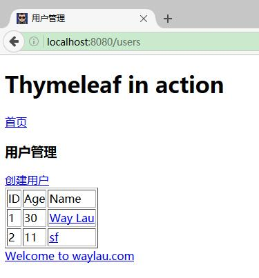
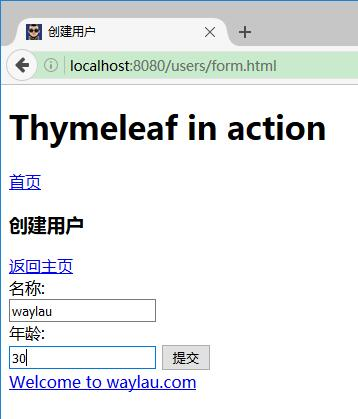
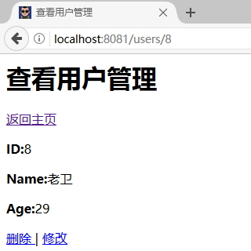

# Thymeleaf 实战

在上一节，我们构建了一个新的项目`thymeleaf-in-action`。通过该项目，我们用 Thymeleaf 来实现一个最简单的“用户管理”功能。

“用户管理”可以实现对用户的查询、新增、删除和修改。 为了简便，我们没有使用数据库管理系统，而是将数据直接保存在了内存。需要注意的是，只要应用重启，数据就会丢失。


## 修改application.properties

增加下面两项配置：

```
spring.thymeleaf.encoding=UTF-8
# 热部署静态文件
spring.thymeleaf.cache=false
# 使用HTML5标准
spring.thymeleaf.mode=HTML5
```


## 后台编码
 
### 修改 UserVO.java

在 UserVO 类里面，增加一个 id 字段，作为不用的用户的唯一表示。

```java
private long id; // 用户的唯一标识
 
public long getId() {
	return id;
}

public void setId(long id) {
	this.id = id;
}
```

### 创建资源库

建包 `com.waylau.spring.boot.thymeleaf.repository`，用于存放用户资源库。

建立用户资源库的接口 ：

```java
public interface UserRepository {
	/**
	 * 新增或者修改用户
	 * @param user
	 * @return
	 */
	UserVO saveOrUpateUser(UserVO user);
	
	/**
	 * 删除用户
	 * @param id
	 */
	void deleteUser(Long id);
	
	/**
	 * 根据用户id获取用户
	 * @param id
	 * @return
	 */
	UserVO getUserById(Long id);
	
	/**
	 * 获取所有用户的列表
	 * @return
	 */
	List<UserVO> listUser();
}
```


 UserRepositoryImpl 作为该类的实现类。其中：

```java
private static AtomicLong counter = new AtomicLong();

private final ConcurrentMap<Long, UserVO> userMap = new ConcurrentHashMap<Long, UserVO>();
```

我们用 `ConcurrentMap<Long, UserVO> userMap`来模拟数据的存储， `AtomicLong counter` 用来生成一个递增的id，作为用户的唯一编号。


### 创建控制器

创建了`com.waylau.spring.boot.thymeleaf.repository.UserManagementController` 用于处理界面的请求。

```
@RestController
@RequestMapping("/users")
public class UserManagementController {

	@Autowired 
	private UserRepositoryImpl userRepository;

	/**
	 * 从 用户存储库 获取用户列表
	 * @return
	 */
	private List<UserVO> getUserlist() {
 		return userRepository.listUser();
	}

	/**
	 * 查询所用用户
	 * @return
	 */
	@GetMapping
	public ModelAndView list() {
		ModelMap model = new ModelMap();
		model.put("userList", getUserlist());
		model.put("title", "用户管理");
		return new ModelAndView("users/list", "userModel", model);
	}

	/**
	 * 根据id查询用户
	 * @param message
	 * @return
	 */
	@GetMapping("{id}")
	public ModelAndView view(@PathVariable("id") Long id) {
		UserVO user = userRepository.getUserById(id);
		ModelMap model = new ModelMap();
		model.put("user", user);
		model.put("title", "查看用户");
		return new ModelAndView("users/view", "userModel", model);
	}

	/**
	 * 获取 form 表单页面
	 * @param user
	 * @return
	 */
	@GetMapping("/form")
	public ModelAndView createForm() {
		ModelMap model = new ModelMap();
		model.put("user", new UserVO());
		model.put("title", "创建用户");
		return new ModelAndView("users/form", "userModel", model);
	}

	/**
	 * 新建用户
	 * @param user
	 * @param result
	 * @param redirect
	 * @return
	 */
	@PostMapping
	public ModelAndView create(UserVO user) {
 		user = userRepository.saveOrUpateUser(user);
		return new ModelAndView("redirect:/users");
	}

	/**
	 * 删除用户
	 * @param id
	 * @return
	 */
	@GetMapping(value = "delete/{id}")
	public ModelAndView delete(@PathVariable("id") Long id) {
		userRepository.deleteUser(id);
		
		ModelMap model = new ModelMap();
		model.put("userList", getUserlist());
		model.put("title", "删除用户");
		return new ModelAndView("users/list", "userModel", model);
	}

	/**
	 * 修改用户
	 * @param user
	 * @return
	 */
	@GetMapping(value = "modify/{id}")
	public ModelAndView modifyForm(@PathVariable("id") Long id) {
		UserVO user = userRepository.getUserById(id);
		
		ModelMap model = new ModelMap();
		model.put("user", user);
		model.put("title", "修改用户");
		return new ModelAndView("users/form", "userModel", model);
	}

}
```

整体的API设计如下：

* GET /users/list ： 返回用于展现用户列表的 list.html 页面；
* GET /users/form ： 返回用于新增或者修改用户的 form.html 页面；
* POST /users ： 新增或者修改用户；
* GET /users/delete/{id} ： 根据id删除相应的用户数据；
* GET /users/modify/{id} ： 根据id删除相应的用户数据。


需要注意的是，本API仅为展现 SpingMVC 的功能，并非完全符合REST风格。如果需要了解详细的 REST 风格架构，可以参考笔者的另外一本开源书[《REST 实战》](https://github.com/waylau/rest-in-action)。

### 编写前台页面

页面主要采用 Thymeleaf 引擎来开发。本节内容为了专注于 Thymeleaf 核心功能，故不涉及  CSS 样式和  JS 脚本的编写。


在`templates`目录下，我们新建一个`users`页面，来归档“用户管理”功能相关的页面。

其中 ：

* list.html：用于展现用户列表；
* form.html：用于新增或者修改用户的资料；
* view.html：用户查看某个用户的资料。

 在`templates`目录下，我们新建一个`fragments`页面，来归档页面共用的部分。

其中 ：

* header.html：共用的头部页面；
* footer.html：共用的底部页面。

## 运行

启动`thymeleaf-in-action`项目后，访问 <localhost:8080/users> 可以看到项目的运行效果。
 
查看用户列表：



新增用户：



查看用户：

